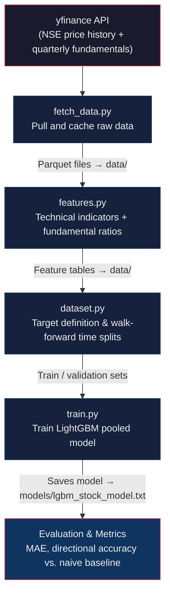
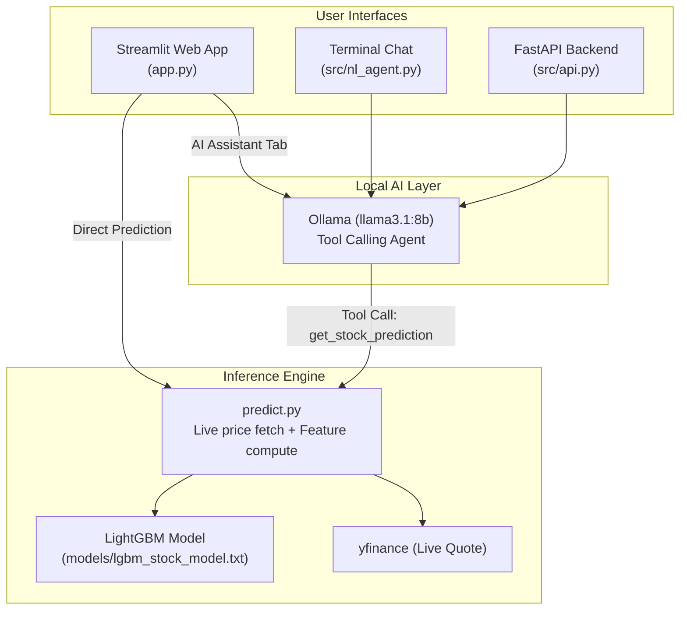

# Stock Price Prediction — Local ML Pipeline with Natural Language Interface


> **Disclaimer:** This is a research and learning project, not financial advice. Do not make buy/sell decisions based solely on model output.

A 100% local, end-to-end machine learning system that trains LightGBM models on Indian stock market data (NSE) and lets you query predictions via an interactive **Streamlit Web Dashboard**, a **FastAPI backend**, or plain English in a **terminal chat agent via local Ollama LLM** — with zero cloud APIs, zero paid data feeds, and complete data privacy.

---

## Key Features

- 📊 **Interactive Streamlit Dashboard:** Visualize live technical indicators, historical candlestick charts, 5-day forecasted returns, and target implied prices in a sleek dark UI.
- 🤖 **Zero-Hallucination AI Assistant:** Natural language agent powered by local Ollama (`llama3.1:8b`) and LangChain. The LLM strictly calls the deterministic prediction tool and never hallucinates numbers.
- ⚡ **FastAPI REST API:** Production-ready backend with interactive Swagger documentation (`/docs`) and `/api/chat` endpoints for programmatic access.
- 🧠 **Cross-Sector Pooled ML Model:** Trains a unified LightGBM model on pooled technical and fundamental features with walk-forward time-series validation.
- 📈 **5 Out-of-the-Box NSE Tickers:** Multi-sector coverage across Conglomerates, IT, Banking, and Energy:
  - **Reliance Industries** (`RELIANCE.NS`)
  - **Tata Consultancy Services** (`TCS.NS`)
  - **HDFC Bank** (`HDFCBANK.NS`)
  - **Infosys** (`INFY.NS`)
  - **Hindustan Petroleum** (`HINDPETRO.NS`)
- 🛠️ **Config-Driven & Extensible:** Easily add new stocks in seconds via [`src/config.py`](src/config.py).

---

## Quick Start

```bash
# 1. Clone repository & create virtual environment
git clone https://github.com/rajan0860/stock-predictor.git
cd stock-predictor

python -m venv .venv
# macOS / Linux
source .venv/bin/activate
# Windows
# .venv\Scripts\activate

# 2. Install dependencies
pip install -r requirements.txt

# 3. Pull local LLM via Ollama
ollama serve &                     # Ensure Ollama is running in the background
ollama pull llama3.1:8b            # One-time download (requires ~4.7 GB)

# 4. Run the ML pipeline
python src/fetch_data.py           # Fetch historical data & fundamentals
python src/features.py             # Compute technical & fundamental features
python src/train.py                # Train LightGBM model & output metrics

# 5. Launch User Interfaces
streamlit run app.py               # Start interactive web dashboard (http://localhost:8501)
# OR
python src/nl_agent.py             # Start terminal natural language chat
# OR
uvicorn src.api:app --reload       # Start FastAPI REST API (http://localhost:8000/docs)
```

**System Requirements:** Python 3.10+, 8 GB+ RAM (for `llama3.1:8b`), standard CPU (no dedicated GPU required). Training completes in under 2 minutes.

---

## Table of Contents

- [Key Features](#key-features)
- [Quick Start](#quick-start)
- [Architecture & Workflow](#architecture--workflow)
  - [Training Pipeline](#training-pipeline)
  - [Inference & Interface Architecture](#inference--interface-architecture)
- [Project Structure](#project-structure)
- [Running the Pipeline](#running-the-pipeline)
- [User Interfaces](#user-interfaces)
  - [1. Streamlit Web App](#1-streamlit-web-dashboard)
  - [2. Natural Language Terminal Agent](#2-natural-language-terminal-agent)
  - [3. FastAPI REST Service](#3-fastapi-rest-service)
- [Adding New Stocks](#adding-new-stocks)
- [Results & Evaluation](#results)
- [Roadmap](#roadmap)
- [Limitations](#limitations)
- [Troubleshooting](#troubleshooting)
- [Documentation & License](#documentation)

---

## Architecture & Workflow

### Training Pipeline



### Inference & Interface Architecture



**Target Formulation:** 5-day forward return (regression):
$$\text{Target} = \frac{P_{t+5} - P_t}{P_t}$$
See [Problem Framing in Architecture docs](docs/ARCHITECTURE.md#1-problem-framing--what-are-we-predicting) for why predicting return is superior to raw price.

---

## Project Structure

```
stock-predictor/
├── app.py                  # Streamlit Web Dashboard (Multi-tab: Forecast & AI Assistant)
├── requirements.txt        # Python dependencies
├── src/
│   ├── config.py           # Central configuration for supported stocks & ticker aliases
│   ├── fetch_data.py       # Step 1: Pull and cache NSE price + fundamentals
│   ├── features.py         # Step 2: Compute technical indicators + fundamental ratios
│   ├── dataset.py          # Target definition & walk-forward time splits
│   ├── train.py            # Step 3: Train LightGBM model, evaluate, and save weights
│   ├── predict.py          # Step 4: Standalone inference engine with live data fetching
│   ├── nl_agent.py         # Step 5: Terminal-based Ollama tool-calling agent
│   └── api.py              # FastAPI REST backend for predictions and LLM chat
├── data/                   # Cached raw parquet files and computed feature tables (gitignored)
├── models/                 # Serialized LightGBM models (gitignored)
├── docs/
│   └── ARCHITECTURE.md     # In-depth technical architecture, feature lists, and validation
├── .devcontainer/          # Container configuration for reproducible environments
├── CONTRIBUTING.md         # Contribution guidelines
├── LICENSE                 # MIT License
└── README.md
```

---

## Running the Pipeline

### Step 1 — Fetch Price History & Fundamentals
```bash
python src/fetch_data.py
```
*Populates `data/` with Parquet files for each ticker (historical prices, financial statements, balance sheets).*

### Step 2 — Build Feature Tables
```bash
python src/features.py
```
*Computes technical indicators (RSI, MACD, Bollinger Bands, Moving Averages, ATR, Volatility) and fundamental ratios (P/E, P/B, Debt-to-Equity, YoY Revenue Growth).*

### Step 3 — Train Model & Evaluate
```bash
python src/train.py
```
*Executes walk-forward cross-validation, logs MAE and Directional Accuracy against a naive baseline, and saves `models/lgbm_stock_model.txt`.*

### Step 4 — Standalone Prediction Sanity Check
```bash
python src/predict.py RELIANCE.NS
```

---

## User Interfaces

### 1. Streamlit Web Dashboard
Launch the interactive web interface:
```bash
streamlit run app.py
```
- **Dashboard Tab:** Choose any supported stock from the dropdown to run real-time inference, view delta pricing, key moving averages, and interactive price charts.
- **AI Assistant Tab:** Chat with your local Ollama LLM to compare outlooks, ask about specific tickers, or get explanations.

### 2. Natural Language Terminal Agent
Run the conversational terminal agent:
```bash
python src/nl_agent.py
```

**Supported Company Names & Aliases:**
| Stock | Supported Names / Aliases | Ticker |
|---|---|---|
| Reliance Industries | `reliance`, `reliance industries` | `RELIANCE.NS` |
| Tata Consultancy Services | `tcs`, `tata consultancy`, `tata consultancy services` | `TCS.NS` |
| HDFC Bank | `hdfc`, `hdfc bank` | `HDFCBANK.NS` |
| Infosys | `infy`, `infosys` | `INFY.NS` |
| Hindustan Petroleum | `hpcl`, `hindustan petroleum`, `hindpetro` | `HINDPETRO.NS` |

**Example Terminal Dialogue:**
```
$ python src/nl_agent.py
Ask about RELIANCE, TCS, HDFCBANK, INFY, or HINDPETRO in plain English. Ctrl+C to exit.

> How does HDFC Bank look this week?

As of 2026-08-14, HDFCBANK.NS closed at Rs.1,642.10.
The model predicts a +1.8% return over the next 5 trading days,
implying a price around Rs.1,671.65. Remember, this is a model estimate,
not financial advice.

> Which one looks better between TCS and Infosys?

Based on current model predictions:
- TCS.NS: Predicted 5-day return is -0.4% (implied Rs.3,980.20)
- INFY.NS: Predicted 5-day return is +1.2% (implied Rs.1,845.50)

Infosys currently shows a more favorable 5-day outlook than TCS according to the model. Note that both are probabilistic estimates with uncertainty.
```

### 3. FastAPI REST Service
Start the REST API server:
```bash
uvicorn src.api:app --reload --port 8000
```
- **Interactive Documentation:** Visit `http://localhost:8000/docs` for the interactive Swagger UI.
- **Chat Endpoint Example:**
  ```bash
  curl -X POST "http://localhost:8000/api/chat" \
       -H "Content-Type: application/json" \
       -d '{"message": "What is the 5-day forecast for Reliance?"}'
  ```

---

## Adding New Stocks

Adding new NSE or global stocks is as simple as adding an entry to `SUPPORTED_STOCKS` in [`src/config.py`](src/config.py):

```python
# src/config.py
SUPPORTED_STOCKS = {
    # ... existing stocks ...
    "ICICIBANK.NS": {
        "name": "ICICI Bank",
        "aliases": ["icici", "icici bank"]
    }
}
```

Then refresh data and retrain the pooled model:
```bash
python src/fetch_data.py
python src/features.py
python src/train.py
```
The new ticker is instantly accessible across the Streamlit UI, Terminal Agent, and FastAPI endpoints.

---

## Results

> ⚠️ **Note:** Stock markets have low signal-to-noise ratios. These are baseline walk-forward validation results; individual fold numbers fluctuate over different market regimes.

Walk-forward validation results (pooled multi-stock model):

| Fold | Train Period | Validation Period | MAE | Directional Accuracy | Naive Baseline Acc |
|:---:|:---:|:---:|:---:|:---:|:---:|
| **1** | 2020 – 2023 | Jan 2024 – Jun 2024 | 0.031 | **53.8%** | 50.4% |
| **2** | 2020 – Jun 2024 | Jul 2024 – Dec 2024 | 0.028 | **55.1%** | 49.2% |
| **3** | 2020 – Dec 2024 | Jan 2025 – Aug 2025 | 0.033 | **52.4%** | 51.0% |

**Top Predictive Features:** `ret_5d`, `rsi_14`, `volatility_20d`, `price_vs_ma20`, `macd_diff`, `revenue_yoy`.

---

## Roadmap

- [x] **Phase 1: Data & Feature Engineering** — Historical caching & technical/fundamental feature pipeline (`fetch_data.py`, `features.py`).
- [x] **Phase 2: Modeling & Inference** — Walk-forward validation, LightGBM training, and live inference engine (`dataset.py`, `train.py`, `predict.py`).
- [x] **Phase 3: LLM Integration** — Local Ollama tool-calling agent with strict grounding (`nl_agent.py`).
- [x] **Phase 4: User Interfaces & APIs** — Streamlit web dashboard (`app.py`) and FastAPI service (`api.py`).
- [ ] **Phase 5: Advanced Enhancements (Upcoming)**
  - [ ] Hyperparameter tuning with Optuna.
  - [ ] News sentiment scoring from RSS feeds via local embeddings.
  - [ ] Risk-adjusted portfolio allocation recommendations.
  - [ ] Backtesting execution simulator with transaction costs & slippage.

---

## Limitations

- **Random Walk Dynamics:** Short-term equity movements contain high noise. Expect directional accuracy to stay within 52–58%.
- **Earnings Surprises & Macro Events:** Technical and quarterly fundamental indicators cannot anticipate sudden geopolitical news or unexpected earnings announcements.
- **Not Financial Advice:** This repository is strictly for educational, ML research, and software engineering demonstration purposes.

---

## Troubleshooting

| Issue | Likely Cause | Solution |
|---|---|---|
| `ConnectionError` in `fetch_data.py` | Rate limit or temporary yfinance network issue | Wait 1 minute and retry. Verify internet connectivity. |
| `ollama` command not recognized | Ollama is not installed or not in system PATH | Download from [ollama.com](https://ollama.com). Ensure Ollama is running (`ollama serve`). |
| LLM gives generic response without numbers | Model selected does not support tool calling | Ensure `llama3.1:8b` is pulled (`ollama pull llama3.1:8b`). |
| `ModuleNotFoundError` for packages | Virtual environment not active | Activate virtual environment (`source .venv/bin/activate`) and run `pip install -r requirements.txt`. |
| Port 8501 / 8000 already in use | Previous Streamlit or FastAPI process running | Run on a different port (e.g., `streamlit run app.py --server.port 8502` or `uvicorn src.api:app --port 8001`). |

---

## Documentation

For a comprehensive deep-dive into the ML framing, feature definitions, validation strategy, and data leakage safeguards, see:
📖 **[docs/ARCHITECTURE.md](docs/ARCHITECTURE.md)**

---

## Contributing

Contributions are welcome! Please feel free to open an issue or submit a Pull Request. See [CONTRIBUTING.md](CONTRIBUTING.md) for contribution guidelines and code style conventions.

---

## Acknowledgments

- **[yfinance](https://github.com/ranaroussi/yfinance)** for market data access.
- **[LightGBM](https://github.com/microsoft/LightGBM)** for fast gradient boosted decision trees.
- **[pandas-ta](https://github.com/twopirllc/pandas-ta)** for financial technical analysis indicators.
- **[Ollama](https://github.com/ollama/ollama)** & **[LangChain](https://github.com/langchain-ai/langchain)** for local tool-calling LLM orchestration.
- **[Streamlit](https://streamlit.io/)** & **[FastAPI](https://fastapi.tiangolo.com/)** for UI and API frameworks.

---

## License

This project is licensed under the [MIT License](LICENSE).
