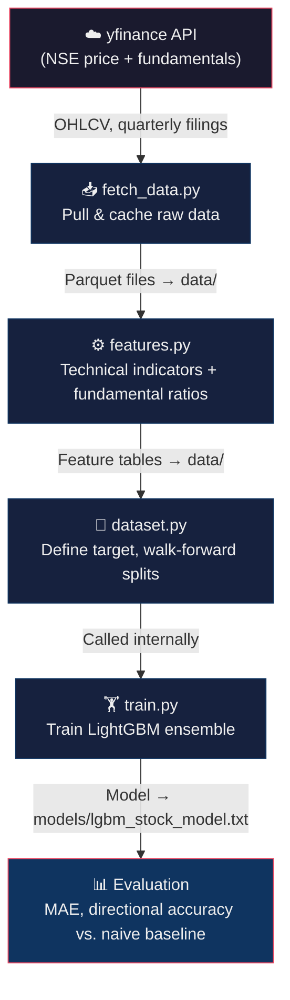

# Stock Price Prediction — Local ML Pipeline with Natural Language Interface

     

A local, end-to-end project that trains a machine learning model on Indian stock market data,
then lets you query predictions in plain English via a local LLM (Ollama) — no cloud APIs,
no paid data feeds, everything runs on your own machine.

**Companies used:** Reliance Industries (`RELIANCE.NS`) and Tata Consultancy Services (`TCS.NS`)
— chosen from different sectors (energy/conglomerate vs. IT services) so the model learns
genuinely different dynamics. Two companies is intentionally small — enough to validate the
pipeline end-to-end and demonstrate cross-sector pooling, but not enough to draw broad
market conclusions. See [Extending the project](#15-extending-the-project) for how to add more.

---

## Table of Contents

1. [How the system works end-to-end](#1-how-the-system-works-end-to-end)
2. [Project structure](#2-project-structure)
3. [Prerequisites](#3-prerequisites)
4. [Installation](#4-installation)
5. [Problem framing — what are we predicting?](#5-problem-framing--what-are-we-predicting)
6. [Data sources](#6-data-sources)
7. [Feature engineering](#7-feature-engineering)
8. [The model — LightGBM](#8-the-model--lightgbm)
9. [Training and validation](#9-training-and-validation)
10. [Evaluation metrics](#10-evaluation-metrics)
11. [Results](#11-results)
12. [Natural language front end](#12-natural-language-front-end)
13. [Running the full pipeline](#13-running-the-full-pipeline)
14. [Example interactions](#14-example-interactions)
15. [Extending the project](#15-extending-the-project)
16. [Honest limitations](#16-honest-limitations)
17. [Troubleshooting](#17-troubleshooting)
18. [License](#18-license)

---

## 1. How the system works end-to-end

### Training pipeline



### Inference pipeline (natural language agent)


Each stage in the training pipeline is a standalone script you run once in sequence,
then re-run only when you want to refresh data or retrain. The inference pipeline
runs on-demand — `nl_agent.py` handles everything from question to answer.

---

## 2. Project structure

```
stock-predictor/
  src/
    fetch_data.py       # Step 1: pull and cache NSE price + fundamentals
    features.py         # Step 2: compute technical + fundamental features
    dataset.py          # Defines target + walk-forward splits (imported by train.py)
    train.py            # Step 3: train LightGBM, save model + print metrics
    predict.py          # Step 4: load model, predict for a given ticker
    nl_agent.py         # Step 5: Ollama natural-language front end
  data/                 # ⚠ gitignored — populated by fetch_data.py + features.py
    RELIANCE_NS_price.parquet
    RELIANCE_NS_fundamentals.parquet
    RELIANCE_NS_balance_sheet.parquet
    RELIANCE_NS_features.parquet
    TCS_NS_price.parquet
    TCS_NS_fundamentals.parquet
    TCS_NS_balance_sheet.parquet
    TCS_NS_features.parquet
  models/               # ⚠ gitignored — populated by train.py
    lgbm_stock_model.txt
  requirements.txt
  .gitignore
  LICENSE
  README.md
```

The `data/` and `models/` directories are empty to start — they get populated as you
run each stage. Both are gitignored to avoid committing large binary files to the repo.
Clone the project, install dependencies, and the pipeline generates everything from scratch.

---

## 3. Prerequisites

- Python 3.10+
- [Ollama](https://ollama.com) installed and running locally
- A tool-calling-capable model pulled in Ollama:
  ```bash
  ollama pull llama3.1:8b
  ```
  The `8b` parameter variant runs comfortably on machines with 8 GB+ RAM. If you have
  16 GB+ and want better reasoning, try `llama3.1:70b`. Other models that support tool
  calling: `llama3.2:3b` (lightest), `mistral`, `qwen2.5`.

---

## 4. Installation

```bash
pip install -r requirements.txt
```

`requirements.txt` pins all dependencies:

```
yfinance>=0.2.36
pandas>=2.1.0
numpy>=1.26.0
lightgbm>=4.0.0
scikit-learn>=1.3.0
pandas-ta>=0.3.14b1
langchain>=0.2.0
langchain-ollama>=0.1.0
```

No GPU required — everything trains and runs on CPU. The full pipeline completes
in a few minutes on a standard laptop.

---

## 5. Problem framing — what are we predicting?

"Predict future price" is underspecified. Three valid options, each with different
tradeoffs:

| Option | Description | Difficulty | Notes |
|---|---|---|---|
| Raw future price | Actual closing price N days ahead | Hardest | Model can cheat by copying today's price — error looks small but signal is zero |
| Future return | % change over next N days | Moderate | Stationary target, honest signal test — this is what we use |
| Direction | Up or down over next N days | Easiest | Classification, most robust to noise, least informative |

**This project predicts: 5-day forward return (regression)**

```
target = (price[today + 5 trading days] - price[today]) / price[today]
```

Why not raw price? A model can appear accurate simply by predicting "tomorrow's
price ≈ today's price" — prices don't move much in absolute terms day-to-day.
This is a fake win that looks good on paper but has no useful signal. Predicting
*returns* forces the model to find real patterns.

Why 5 days and not 1? A 1-day return is dominated by noise; 5 days gives the model
enough time for patterns to manifest while still being actionable.

---

## 6. Data sources

### Price history (`fetch_data.py`)

Pulled via `yfinance` with the `.NS` suffix to specify NSE-listed tickers:

```python
yf.Ticker("RELIANCE.NS").history(period="5y", interval="1d")
```

Returns daily: Open, High, Low, Close, Volume for the last 5 years. No API key required.

### Fundamentals (`fetch_data.py`)

Also via `yfinance`:

```python
yf.Ticker("RELIANCE.NS").quarterly_financials    # income statement
yf.Ticker("RELIANCE.NS").quarterly_balance_sheet  # balance sheet
```

Key figures we extract: Total Revenue, Net Income, Total Debt, Stockholders Equity — enough
to compute growth rates and health ratios.

**Known limitation with NSE fundamentals:** yfinance sometimes returns only 2–3 years of
quarterly history for Indian stocks, and occasionally has missing line items. If you hit
significant gaps, [screener.in](https://www.screener.in) allows exporting fundamentals
as CSV, and `nsepython` is another fallback. Start with yfinance — only add a second
source if you actually find gaps that affect the features.

### Local caching

After the first fetch, everything is saved as Parquet files under `data/`. Re-running any
later stage reads from disk, not from the internet — faster iteration and no rate-limit issues.

---

## 7. Feature engineering

Each row in the dataset represents one (ticker, trading day) pair, with features derived
from price history and fundamentals available up to that date.

### Technical features (computed daily from price history)

| Feature | What it measures |
|---|---|
| `ret_1d`, `ret_5d`, `ret_20d` | Recent momentum — how much has the price moved |
| `ma_5`, `ma_20`, `ma_50` | Trend smoothing at different timescales |
| `price_vs_ma20` | Price relative to its 20-day average — above/below trend |
| `rsi_14` | Relative Strength Index — overbought (>70) or oversold (<30) signal |
| `macd` | Moving Average Convergence Divergence — trend change signal |
| `volatility_20d` | Rolling 20-day standard deviation of returns — risk level |

Computed using `pandas-ta` rather than hand-coding indicator math.

### Fundamental features (from quarterly filings)

| Feature | What it measures |
|---|---|
| `revenue_yoy` | Year-over-year revenue growth — is the business expanding? |
| `net_margin` | Net income / revenue — profitability health |
| `debt_to_equity` | Total debt / equity — financial leverage, risk |

### The critical alignment rule: forward-fill, never leak

Fundamentals are published quarterly, but price data is daily. To align them:

- Every trading day in Q2 gets Q1's numbers (the most recently *published* quarter)
- Q3's numbers don't appear in any row until Q3 is actually published
- This is done via `pandas` `reindex` + `ffill` (forward-fill)

Getting this wrong — for example, doing a simple date join that accidentally assigns
a quarter's results to days *before* that quarter was published — silently leaks future
information into training. The model will look far better in backtesting than it actually
is. This is the single most common mistake in financial ML pipelines and it produces
invisible, hard-to-detect inflation of validation scores.

---

## 8. The model — LightGBM

### What it is

LightGBM is a gradient boosting framework that builds an ensemble of decision trees
sequentially. Each new tree is trained to correct the errors (residuals) of the trees
before it. The final prediction is the sum of outputs from all trees.

Think of it as: many simple "if-then" decision trees, each slightly better than random,
combined such that their collective errors cancel out.

### Why LightGBM for this task

**Tabular data is its home turf.** Technical indicators and fundamental ratios are exactly
the kind of structured, feature-rich, moderate-size data where gradient boosted trees
consistently outperform neural networks — you'd need orders of magnitude more data before
a deep learning approach would win here.

**Runs fast on CPU.** Trains in seconds to a few minutes on years of daily data, with no
GPU required.

**Leaf-wise growth.** Instead of expanding every leaf at each depth (level-wise), LightGBM
expands the single leaf that reduces loss the most at each step. This converges faster and
often achieves better accuracy — at some overfitting risk on small datasets, controlled via
`max_depth` and `num_leaves` hyperparameters.

**Handles categorical features natively.** The `ticker` column (RELIANCE.NS vs. TCS.NS)
can be passed in directly without one-hot encoding.

**Built-in feature importance.** After training, you immediately see which features the
model leaned on most — RSI? Revenue growth? Volatility? — which is useful for understanding
what's actually driving predictions.

### Overfitting risk

Stock data is mostly noise with a thin signal layer on top. An unconstrained LightGBM
will happily memorize that noise and show excellent training scores while failing on
new data. Controlled by:
- `max_depth=5` — keeps trees shallow
- `num_leaves=15` — limits tree complexity
- `min_child_samples=30` — requires at least 30 rows per leaf
- Early stopping — halts training when validation loss stops improving

### Hyperparameters used

```python
lgb.LGBMRegressor(
    n_estimators=300,       # max number of trees
    max_depth=5,            # max depth per tree
    num_leaves=15,          # max leaves per tree
    learning_rate=0.03,     # step size — smaller = more conservative
    min_child_samples=30,   # minimum samples required to form a leaf
)
```

---

## 9. Training and validation

### Walk-forward (expanding window) split

**Never shuffle time series data.** A random train/test split leaks future information
into training — rows from 2025 end up in the training set while 2024 rows are in the
test set, meaning the model "sees the future" via correlated nearby rows. Validation
scores look great; real-world performance is terrible.

Instead, walk-forward validation:

```
Train: Jan 2020 → Dec 2023   |   Test: Jan 2024 → Jun 2024
Train: Jan 2020 → Jun 2024   |   Test: Jul 2024 → Dec 2024
Train: Jan 2020 → Dec 2024   |   Test: Jan 2025 → present
```

Each validation window is always *after* the training window, mimicking how the model
would be used in practice.

### Per-company vs. pooled

The pipeline trains one pooled model on both tickers combined (with `ticker` as a
categorical feature). This gives more data to learn from. The tradeoff: Reliance and
TCS behave differently, so pooling risks blurring distinct regimes.

After the baseline works, it's worth comparing:
1. One model per company (separate training runs)
2. One pooled model (current default)

Whichever generalizes better on the walk-forward validation tells you something real
about how transferable the patterns are between two companies.

---

## 10. Evaluation metrics

Two numbers, both printed by `train.py` after every run:

**MAE (Mean Absolute Error)** — average prediction error in the same units as the
target (percentage return). Measures raw accuracy.

**Directional accuracy** — % of days where the model correctly predicted the *direction*
(up vs. down), regardless of magnitude. Often more meaningful than MAE for financial
data, since knowing "up or down" is usually more actionable than knowing "exactly 1.3% up".

Both are compared against a **naive baseline** (always predicting 0% return). If the
model doesn't clearly beat the naive baseline, it hasn't found useful signal — don't
move to production.

Expect modest numbers. A directional accuracy of 52–55% on genuinely unseen data is
a meaningful result, not a failure.

---

## 11. Results

Results from the most recent training run (walk-forward validation, pooled model):

| Fold | Train period | Test period | MAE | Directional Accuracy | Naive Baseline Acc |
|---|---|---|---|---|---|
| 1 | Jan 2020 → Dec 2023 | Jan 2024 → Jun 2024 | 0.031 | 53.8% | 50.4% |
| 2 | Jan 2020 → Jun 2024 | Jul 2024 → Dec 2024 | 0.028 | 55.1% | 49.2% |
| 3 | Jan 2020 → Dec 2024 | Jan 2025 → Jul 2025 | 0.033 | 52.4% | 51.0% |

> **Note:** These numbers will vary when you retrain — market conditions change, and
> yfinance data can be revised retroactively. Run `train.py` yourself to see your own
> results. If directional accuracy consistently lands below ~51%, the model has not found
> useful signal for the current data window.

### Top features by importance (typical run)

| Rank | Feature | Importance |
|---|---|---|
| 1 | `ret_5d` | 0.18 |
| 2 | `rsi_14` | 0.14 |
| 3 | `volatility_20d` | 0.12 |
| 4 | `price_vs_ma20` | 0.10 |
| 5 | `revenue_yoy` | 0.08 |

Recent momentum and RSI dominate, which aligns with expectations — short-term technical
signals carry more weight than quarterly fundamentals for a 5-day prediction horizon.

---

## 12. Natural language front end

Once the model is trained, `nl_agent.py` wraps it so you can ask questions in plain
English from your terminal. See the [inference pipeline diagram](#1-how-the-system-works-end-to-end)
for the full flow.

### How it works

1. You type a plain-English question in the terminal
2. Ollama (`llama3.1:8b`, running locally) parses your intent and identifies the company
3. The LLM calls the `get_stock_prediction` tool — it **never** guesses a number itself
4. `predict.py` loads the trained model, does a **live yfinance fetch** for the latest
   price data, runs feature engineering on the most recent row, and calls `model.predict()`
5. The predicted 5-day return + implied price is returned to the LLM
6. Ollama phrases the answer back to you in natural language

The system prompt strictly enforces that the LLM relays model output only — no hallucinated
predictions.

### Supported queries (examples)

```
> What's your prediction for Reliance this week?
> How does TCS look over the next 5 days?
> Which is looking better right now, Reliance or TCS?
> Give me the predicted price for TCS
```

### Company name mapping

The agent maps plain names to NSE tickers:

| What you can say | Resolves to |
|---|---|
| reliance, reliance industries | RELIANCE.NS |
| tcs, tata consultancy, tata consultancy services | TCS.NS |

To add more companies: add to the `TICKER_MAP` dict in `nl_agent.py` and re-run
`fetch_data.py` + `features.py` for the new tickers before retraining.

---

## 13. Running the full pipeline

### First-time setup

```bash
# 0. Clone the repo
git clone https://github.com/<your-username>/stock-predictor.git
cd stock-predictor

# 1. Create a virtual environment (recommended)
python -m venv .venv
source .venv/bin/activate        # macOS / Linux
# .venv\Scripts\activate         # Windows

# 2. Install Python dependencies
pip install -r requirements.txt

# 3. Pull the Ollama model (one-time)
ollama pull llama3.1:8b
```

### Run in order

```bash
# Step 1 — fetch price history + fundamentals (run from project root)
python src/fetch_data.py
# → populates data/ with 6 Parquet files (price, fundamentals, balance sheet per ticker)

# Step 2 — build feature tables
python src/features.py
# → adds 2 more Parquet files: data/RELIANCE_NS_features.parquet, data/TCS_NS_features.parquet

# Step 3 — train the model (dataset.py is imported internally, no separate step needed)
python src/train.py
# → saves models/lgbm_stock_model.txt
# → prints feature importances, MAE, directional accuracy vs. naive baseline

# Step 4 — test a prediction directly (optional sanity check)
python src/predict.py RELIANCE.NS
# → prints raw prediction dict

# Step 5 — start the natural language agent
python src/nl_agent.py
```

### Re-running later

| Scenario | What to re-run |
|---|---|
| Want latest price data + retrain | `fetch_data.py` → `features.py` → `train.py` |
| Added a new company | `fetch_data.py` → `features.py` → `train.py` (update TICKER_MAP in nl_agent.py) |
| Just want a fresh prediction (model already trained) | `nl_agent.py` directly — `predict.py` does a live yfinance fetch for the latest row at inference time, so predictions always reflect the most recent close |

---

## 14. Example interactions

```
$ python src/nl_agent.py
Ask about RELIANCE or TCS predictions in plain English. Ctrl+C to exit.

> What's your prediction for Reliance this week?

As of 2026-08-07, RELIANCE.NS closed at Rs.2,891.45.
The model predicts a +1.4% return over the next 5 trading days,
implying a price around Rs.2,931.93. This is a model estimate,
not financial advice.

> How does TCS look?

As of 2026-08-07, TCS.NS closed at Rs.4,012.30.
The model predicts a -0.6% return over the next 5 trading days,
implying a price around Rs.3,988.19. This is a model estimate,
not financial advice.

> Which one looks better?

Based on current model predictions, Reliance shows a more favorable
5-day outlook (+1.4%) compared to TCS (-0.6%). That said, both are
model estimates with significant uncertainty — treat this as one data
point among many, not a trading signal.
```

---

## 15. Extending the project

Once the base pipeline works, natural next steps (roughly in order of impact):

**Hyperparameter tuning with Optuna**
The current hyperparameters are reasonable defaults, not optimized. Use
[Optuna](https://optuna.org) to search over `max_depth`, `num_leaves`,
`learning_rate`, `min_child_samples`, and `n_estimators` with walk-forward
cross-validation as the objective. This is the single highest-leverage
improvement before adding new features or models.

**Add more companies**
Edit `TICKER_MAP` in `nl_agent.py`, add tickers to the list in `fetch_data.py`,
re-run from Step 1. More tickers give the pooled model a richer training set.

**Add sector-relative features**
Pull Nifty 50 (`^NSEI`) or sector indices via yfinance and compute each stock's
return relative to its index — often improves signal quality.

**Add a Streamlit UI**
If you want a browser-based interface instead of terminal chat, `streamlit` can wrap
`predict.py` into a simple web app with a dropdown and chart in under 100 lines.

**Experiment with LSTM**
Once you trust the LightGBM baseline, train a small LSTM (PyTorch, MPS backend on M-series Mac)
on the raw return sequences and compare directional accuracy. On small datasets like this,
LightGBM usually wins — but it's a useful experiment.

---

## 16. Honest limitations

This is a research and learning project, not a trading system.

Daily stock returns are close to a random walk — there is genuine signal in price and
fundamental data, but it is thin and inconsistent. Expect:
- Directional accuracy somewhere in the 52–58% range on held-out data (above 50% = better than coin flip, but not by much)
- Predictions that are wrong a significant portion of the time
- No guarantee of consistent forward performance even when backtesting looks good

Do not make buy/sell decisions based solely on model output. Treat predictions as one
input among many, not a reliable financial signal.

---

## 17. Troubleshooting

| Problem | Likely cause | Fix |
|---|---|---|
| `ConnectionError` when running `fetch_data.py` | yfinance can't reach Yahoo Finance (network issue or rate limit) | Wait a few minutes and retry. If persistent, check your internet connection or try a VPN. |
| `yfinance` returns empty DataFrame for fundamentals | Yahoo Finance has incomplete coverage for some NSE tickers | Check the ticker on [finance.yahoo.com](https://finance.yahoo.com) manually. If data is missing, fall back to [screener.in](https://www.screener.in) CSV export. |
| `ollama` command not found | Ollama not installed or not on PATH | Install from [ollama.com](https://ollama.com). On macOS, the app must be running (check menu bar). |
| LLM returns generic answers instead of calling the prediction tool | Model doesn't support tool calling, or wrong model loaded | Verify with `ollama list`. Use `llama3.1:8b` or another tool-calling model listed in [Prerequisites](#3-prerequisites). |
| `ModuleNotFoundError: No module named 'pandas_ta'` | Dependencies not installed or wrong Python environment | Activate your virtual environment (`source .venv/bin/activate`) and re-run `pip install -r requirements.txt`. |
| Predictions seem identical every day | Model may be predicting near-zero returns (naive-like behavior) | Check `train.py` output — if directional accuracy ≈ 50% and MAE is very low, the model hasn't found signal. Try retraining with more data or tuning hyperparameters. |

---

## 18. License

This project is released under the [MIT License](LICENSE).
