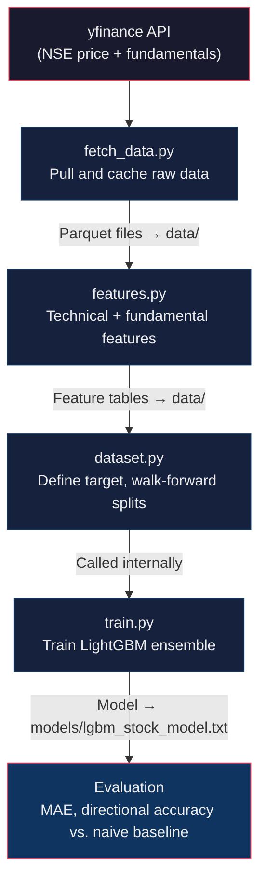
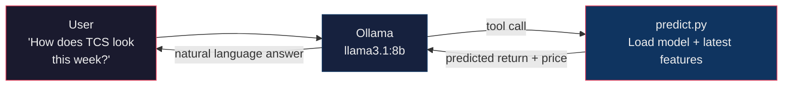

# Stock Price Prediction — Local ML Pipeline with Natural Language Interface

     

> **Status:** Pipeline scripts in `src/` are not yet implemented — this repo currently
> ships the design docs and project scaffold. See [Roadmap](#roadmap) for what's coming.

> **Disclaimer:** This is a research and learning project, not financial advice. Do not
> make buy/sell decisions based solely on model output.

A local, end-to-end project that trains a machine learning model on Indian stock market data,
then lets you query predictions in plain English via a local LLM (Ollama) — no cloud APIs,
no paid data feeds, everything runs on your own machine.

**Companies:** Reliance Industries (`RELIANCE.NS`) and Tata Consultancy Services (`TCS.NS`)
— two sectors (energy/conglomerate vs. IT) to validate cross-sector pooling. See
[Architecture docs](docs/ARCHITECTURE.md#7-extending-the-project) for adding more tickers.

---

## Quick start

```bash
git clone https://github.com/rajan0860/stock-predictor.git
cd stock-predictor

python -m venv .venv
# macOS / Linux
source .venv/bin/activate
# Windows
# .venv\Scripts\activate

pip install -r requirements.txt
ollama serve &                     # ensure Ollama is running in the background
ollama pull llama3.1:8b            # one-time; requires Ollama installed

# Run the pipeline (once src/ scripts land)
python src/fetch_data.py
python src/features.py
python src/train.py
python src/nl_agent.py             # Optional: terminal-based chat
streamlit run app.py               # Start the web dashboard
```

**System requirements:** Python 3.10+, 8 GB+ RAM (for `llama3.1:8b`), no GPU needed.
Training completes in a few minutes on a standard laptop.

---

## Table of Contents

- [How it works](#how-it-works)
- [Project structure](#project-structure)
- [Running the pipeline](#running-the-pipeline)
- [Natural language interface](#natural-language-interface)
- [Example interactions](#example-interactions)
- [Results](#results)
- [Roadmap](#roadmap)
- [Limitations](#limitations)
- [Troubleshooting](#troubleshooting)
- [Documentation](#documentation)
- [Contributing](#contributing)
- [Acknowledgments](#acknowledgments)
- [License](#license)

---

## How it works

### Training pipeline



### Inference pipeline



Each training stage is a standalone script you run once in sequence, then re-run only
when refreshing data or retraining. Inference runs on-demand via `nl_agent.py`.

**Target:** 5-day forward return (regression), not raw price — see
[problem framing](docs/ARCHITECTURE.md#1-problem-framing--what-are-we-predicting) for why.

---

## Project structure

```
stock-predictor/
  src/                  # Pipeline scripts (coming soon)
    fetch_data.py       # Step 1: pull and cache NSE price + fundamentals
    features.py         # Step 2: compute technical + fundamental features
    dataset.py          # Target + walk-forward splits (imported by train.py)
    train.py            # Step 3: train LightGBM, save model + print metrics
    predict.py          # Step 4: load model, predict for a given ticker
    nl_agent.py         # Step 5: Ollama natural-language front end
  data/                 # gitignored — populated by fetch_data.py + features.py
  models/               # gitignored — populated by train.py
  docs/
    ARCHITECTURE.md     # Deep-dive: features, model, validation, extensions
  requirements.txt
  LICENSE
  README.md
```

The `data/` and `models/` directories are empty until you run the pipeline. Both are
gitignored to avoid committing large binary files.

---

## Running the pipeline

### Prerequisites

- Python 3.10+
- [Ollama](https://ollama.com) installed and running locally
- A tool-calling model pulled in Ollama:
  ```bash
  ollama pull llama3.1:8b
  ```
  The `8b` variant runs on 8 GB+ RAM. With 16 GB+, try `llama3.1:70b`. Other
  tool-calling options: `llama3.2:3b` (lightest), `mistral`, `qwen2.5`.

### Run in order

```bash
# Step 1 — fetch price history + fundamentals
python src/fetch_data.py
# → populates data/ with 6 Parquet files (price, fundamentals, balance sheet per ticker)

# Step 2 — build feature tables
python src/features.py
# → adds data/RELIANCE_NS_features.parquet, data/TCS_NS_features.parquet

# Step 3 — train the model (dataset.py is imported internally)
python src/train.py
# → saves models/lgbm_stock_model.txt
# → prints feature importances, MAE, directional accuracy vs. naive baseline

# Step 4 — test a prediction directly (optional sanity check)
python src/predict.py RELIANCE.NS

# Step 5 — start the natural language agent (optional)
python src/nl_agent.py

# Step 6 — start the Streamlit Web Dashboard
streamlit run app.py
# (Dashboard will open automatically at http://localhost:8501)
```

### Re-running later

| Scenario | What to re-run |
|---|---|
| Latest price data + retrain | `fetch_data.py` → `features.py` → `train.py` |
| Added a new company | Same as above + update `TICKER_MAP` in `nl_agent.py` |
| Fresh prediction (model already trained) | `nl_agent.py` directly — `predict.py` live-fetches the latest close at inference time |

---

## Natural language interface

Once trained, `nl_agent.py` wraps the model so you can ask questions in plain English:

1. You type a question in the terminal
2. Ollama parses intent and identifies the company
3. The LLM calls the `get_stock_prediction` tool — it **never** guesses a number itself
4. `predict.py` loads the model, live-fetches latest prices, runs feature engineering, and predicts
5. Ollama phrases the answer back in natural language

The system prompt enforces that the LLM relays model output only — no hallucinated predictions.

**Company name mapping:**

| What you can say | Resolves to |
|---|---|
| reliance, reliance industries | RELIANCE.NS |
| tcs, tata consultancy, tata consultancy services | TCS.NS |

---

## Example interactions

```
$ python src/nl_agent.py
Ask about RELIANCE or TCS predictions in plain English. Ctrl+C to exit.

> What's your prediction for Reliance this week?

As of 2026-08-07, RELIANCE.NS closed at Rs.2,891.45.
The model predicts a +1.4% return over the next 5 trading days,
implying a price around Rs.2,931.93. This is a model estimate,
not financial advice.

> How does TCS look?

As of 2026-08-07, TCS.NS closed at Rs.4,012.30.
The model predicts a -0.6% return over the next 5 trading days,
implying a price around Rs.3,988.19. This is a model estimate,
not financial advice.

> Which one looks better?

Based on current model predictions, Reliance shows a more favorable
5-day outlook (+1.4%) compared to TCS (-0.6%). That said, both are
model estimates with significant uncertainty — treat this as one data
point among many, not a trading signal.
```

---

## Results

> ⚠️ **Note:** The numbers below are illustrative projections to show the expected format and rough baseline, not actual training results. Your numbers will vary.

Example walk-forward validation results (pooled model):

| Fold | Train period | Test period | MAE | Directional Accuracy | Naive Baseline Acc |
|---|---|---|---|---|---|
| 1 | Jan 2020 → Dec 2023 | Jan 2024 → Jun 2024 | 0.031 | 53.8% | 50.4% |
| 2 | Jan 2020 → Jun 2024 | Jul 2024 → Dec 2024 | 0.028 | 55.1% | 49.2% |
| 3 | Jan 2020 → Dec 2024 | Jan 2025 → Jul 2025 | 0.033 | 52.4% | 51.0% |

**Typical top features:** `ret_5d`, `rsi_14`, `volatility_20d`, `price_vs_ma20`, `revenue_yoy`
— short-term technicals dominate over quarterly fundamentals for a 5-day horizon.

Run `train.py` yourself after implementation to get current numbers. If directional accuracy
consistently lands below ~51%, the model has not found useful signal.

---

## Roadmap

**Phase 1: Data & Features**
- [ ] `fetch_data.py` — pull and cache NSE price + fundamentals via yfinance
- [ ] `features.py` — technical indicators + fundamental ratios

**Phase 2: Modeling**
- [ ] `dataset.py` + `train.py` — walk-forward splits, LightGBM training
- [ ] `predict.py` — single-ticker inference with live data fetch

**Phase 3: LLM Integration**
- [ ] `nl_agent.py` — Ollama tool-calling agent

---

## Limitations

This is a research and learning project, not a trading system. Daily stock returns are
close to a random walk — signal exists but is thin and inconsistent. Expect directional
accuracy in the 52–58% range on held-out data, predictions that are wrong a significant
portion of the time, and no guarantee of forward performance even when backtesting looks good.

See [Architecture docs](docs/ARCHITECTURE.md) for evaluation metrics, data leakage pitfalls,
and extension ideas.

---

## Troubleshooting

| Problem | Likely cause | Fix |
|---|---|---|
| `ConnectionError` when running `fetch_data.py` | yfinance can't reach Yahoo Finance | Wait and retry. Check internet or try a VPN. |
| Empty fundamentals DataFrame | Incomplete Yahoo coverage for some NSE tickers | Verify on [finance.yahoo.com](https://finance.yahoo.com). Fall back to [screener.in](https://www.screener.in) CSV export. |
| `ollama` command not found | Ollama not installed or not on PATH | Install from [ollama.com](https://ollama.com). On macOS, the app must be running. |
| LLM returns generic answers, no tool call | Model doesn't support tool calling | Verify with `ollama list`. Use `llama3.1:8b` or another tool-calling model. |
| `ModuleNotFoundError: No module named 'pandas_ta'` | Wrong Python environment | Activate venv and re-run `pip install -r requirements.txt`. |
| Predictions seem identical every day | Model predicting near-zero returns | Check `train.py` output — if directional accuracy ≈ 50%, retrain or tune hyperparameters. |

---

## Documentation

| Doc | Contents |
|---|---|
| [docs/ARCHITECTURE.md](docs/ARCHITECTURE.md) | Problem framing, data sources, feature engineering, LightGBM rationale, walk-forward validation, evaluation metrics, extension ideas |

---

## Contributing

Contributions are welcome! Since this is an actively evolving project, please check the [Roadmap](#roadmap) to see what's currently in progress. 

See [CONTRIBUTING.md](CONTRIBUTING.md) for guidelines on how to report issues, suggest features, and submit pull requests.

---

## Acknowledgments

This project relies on several excellent open-source tools:
- **[yfinance](https://github.com/ranaroussi/yfinance)** for fetching market data
- **[LightGBM](https://github.com/microsoft/LightGBM)** for the gradient boosting framework
- **[pandas-ta](https://github.com/twopirllc/pandas-ta)** for technical indicators
- **[Ollama](https://github.com/ollama/ollama)** and **[LangChain](https://github.com/langchain-ai/langchain)** for local LLM orchestration

---

## License

This project is released under the [MIT License](LICENSE).
