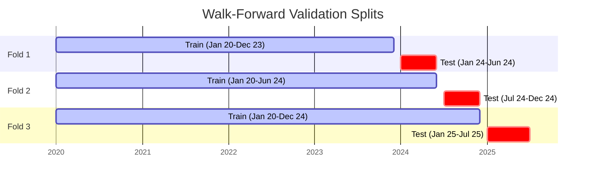

# Architecture & Design Notes

Deep-dive documentation for the stock prediction pipeline. For setup and run
instructions, see the [README](../README.md).

---

## Table of Contents

1. [Problem framing](#1-problem-framing--what-are-we-predicting)
2. [Data sources](#2-data-sources)
3. [Feature engineering](#3-feature-engineering)
4. [The model — LightGBM](#4-the-model--lightgbm)
5. [Training and validation](#5-training-and-validation)
6. [Evaluation metrics](#6-evaluation-metrics)
7. [Extending the project](#7-extending-the-project)

---

## 1. Problem framing — what are we predicting?

"Predict future price" is underspecified. Three valid options, each with different
tradeoffs:

| Option | Description | Difficulty | Notes |
|---|---|---|---|
| Raw future price | Actual closing price N days ahead | Hardest | Model can cheat by copying today's price — error looks small but signal is zero |
| Future return | % change over next N days | Moderate | Stationary target, honest signal test — this is what we use |
| Direction | Up or down over next N days | Easiest | Classification, most robust to noise, least informative |

**This project predicts: 5-day forward return (regression)**

```python
target = (price[today + 5 trading days] - price[today]) / price[today]
```

Why not raw price? A model can appear accurate simply by predicting "tomorrow's
price ≈ today's price" — prices don't move much in absolute terms day-to-day.
This is a fake win that looks good on paper but has no useful signal. Predicting
*returns* forces the model to find real patterns.

Why 5 days and not 1? A 1-day return is dominated by noise; 5 days gives the model
enough time for patterns to manifest while still being actionable.

---

## 2. Data sources

### Price history (`fetch_data.py`)

Pulled via `yfinance` with the `.NS` suffix to specify NSE-listed tickers:

```python
yf.Ticker("RELIANCE.NS").history(period="5y", interval="1d")
```

Returns daily: Open, High, Low, Close, Volume for the last 5 years. No API key required.

### Fundamentals (`fetch_data.py`)

Also via `yfinance`:

```python
yf.Ticker("RELIANCE.NS").quarterly_financials    # income statement
yf.Ticker("RELIANCE.NS").quarterly_balance_sheet  # balance sheet
```

Key figures we extract: Total Revenue, Net Income, Total Debt, Stockholders Equity — enough
to compute growth rates and health ratios.

**Known limitation with NSE fundamentals:** yfinance sometimes returns only 2–3 years of
quarterly history for Indian stocks, and occasionally has missing line items. If you hit
significant gaps, [screener.in](https://www.screener.in) allows exporting fundamentals
as CSV, and `nsepython` is another fallback. Start with yfinance — only add a second
source if you actually find gaps that affect the features.

### Local caching

After the first fetch, everything is saved as Parquet files under `data/`. Re-running any
later stage reads from disk, not from the internet — faster iteration and no rate-limit issues.

### What leaves your machine

- **yfinance** calls Yahoo Finance over the internet for price and fundamentals data.
- **Ollama** runs entirely locally — no LLM queries leave your machine.

---

## 3. Feature engineering

Each row in the dataset represents one (ticker, trading day) pair, with features derived
from price history and fundamentals available up to that date.

### Technical features (computed daily from price history)

| Feature | What it measures |
|---|---|
| `ret_1d`, `ret_5d`, `ret_20d` | Recent momentum — how much has the price moved |
| `ma_5`, `ma_20`, `ma_50` | Trend smoothing at different timescales |
| `price_vs_ma20` | Price relative to its 20-day average — above/below trend |
| `rsi_14` | Relative Strength Index — overbought (>70) or oversold (<30) signal |
| `macd` | Moving Average Convergence Divergence — trend change signal |
| `volatility_20d` | Rolling 20-day standard deviation of returns — risk level |

Computed using `pandas-ta` rather than hand-coding indicator math.

### Fundamental features (from quarterly filings)

| Feature | What it measures |
|---|---|
| `revenue_yoy` | Year-over-year revenue growth — is the business expanding? |
| `net_margin` | Net income / revenue — profitability health |
| `debt_to_equity` | Total debt / equity — financial leverage, risk |

### The critical alignment rule: forward-fill, never leak

Fundamentals are published quarterly, but price data is daily. To align them:

- Every trading day in Q2 gets Q1's numbers (the most recently *published* quarter)
- Q3's numbers don't appear in any row until Q3 is actually published
- This is done via `pandas` `reindex` + `ffill` (forward-fill)

Getting this wrong — for example, doing a simple date join that accidentally assigns
a quarter's results to days *before* that quarter was published — silently leaks future
information into training. The model will look far better in backtesting than it actually
is. This is the single most common mistake in financial ML pipelines and it produces
invisible, hard-to-detect inflation of validation scores.

---

## 4. The model — LightGBM

### What it is

LightGBM is a gradient boosting framework that builds an ensemble of decision trees
sequentially. Each new tree is trained to correct the errors (residuals) of the trees
before it. The final prediction is the sum of outputs from all trees.

Think of it as: many simple "if-then" decision trees, each slightly better than random,
combined such that their collective errors cancel out.

### Why LightGBM for this task

**Tabular data is its home turf.** Technical indicators and fundamental ratios are exactly
the kind of structured, feature-rich, moderate-size data where gradient boosted trees
consistently outperform neural networks — you'd need orders of magnitude more data before
a deep learning approach would win here.

**Runs fast on CPU.** Trains in seconds to a few minutes on years of daily data, with no
GPU required.

**Leaf-wise growth.** Instead of expanding every leaf at each depth (level-wise), LightGBM
expands the single leaf that reduces loss the most at each step. This converges faster and
often achieves better accuracy — at some overfitting risk on small datasets, controlled via
`max_depth` and `num_leaves` hyperparameters.

**Handles categorical features natively.** The `ticker` column (RELIANCE.NS vs. TCS.NS)
can be passed in directly without one-hot encoding.

**Built-in feature importance.** After training, you immediately see which features the
model leaned on most — RSI? Revenue growth? Volatility? — which is useful for understanding
what's actually driving predictions.

### Overfitting risk

Stock data is mostly noise with a thin signal layer on top. An unconstrained LightGBM
will happily memorize that noise and show excellent training scores while failing on
new data. Controlled by:
- `max_depth=5` — keeps trees shallow
- `num_leaves=15` — limits tree complexity
- `min_child_samples=30` — requires at least 30 rows per leaf
- Early stopping — halts training when validation loss stops improving

### Hyperparameters used

Reasonable starting points (and search ranges for Optuna):

```python
lgb.LGBMRegressor(
    n_estimators=300,       # max number of trees (search: 100-1000)
    max_depth=5,            # max depth per tree (search: 3-8)
    num_leaves=15,          # max leaves per tree (search: 10-50)
    learning_rate=0.03,     # step size (search: 0.01-0.1)
    min_child_samples=30,   # minimum samples to form a leaf (search: 20-100)
)
```

---

## 5. Training and validation

### Walk-forward (expanding window) split

**Never shuffle time series data.** A random train/test split leaks future information
into training — rows from 2025 end up in the training set while 2024 rows are in the
test set, meaning the model "sees the future" via correlated nearby rows. Validation
scores look great; real-world performance is terrible.

Instead, walk-forward validation:



Each validation window is always *after* the training window, mimicking how the model
would be used in practice.

### Per-company vs. pooled

The pipeline trains one pooled model on both tickers combined (with `ticker` as a
categorical feature). This gives more data to learn from. The tradeoff: Reliance and
TCS behave differently, so pooling risks blurring distinct regimes.

After the baseline works, it's worth comparing:
1. One model per company (separate training runs)
2. One pooled model (current default)

Whichever generalizes better on the walk-forward validation tells you something real
about how transferable the patterns are between two companies.

### Reproducibility

To ensure your validation results are reproducible across runs, always set random seeds (e.g., `random_state=42` in LightGBM, `np.random.seed(42)`).

---

## 6. Evaluation metrics

Two numbers, both printed by `train.py` after every run:

**MAE (Mean Absolute Error)** — average prediction error in the same units as the
target (percentage return). Measures raw accuracy.

**Directional accuracy** — % of days where the model correctly predicted the *direction*
(up vs. down), regardless of magnitude. Often more meaningful than MAE for financial
data, since knowing "up or down" is usually more actionable than knowing "exactly 1.3% up".

Both are compared against a **naive baseline** (always predicting 0% return). If the
model doesn't clearly beat the naive baseline, it hasn't found useful signal — don't
move to production.

Expect modest numbers. A directional accuracy of 52–55% on genuinely unseen data is
a meaningful result, not a failure.

---

## 7. Extending the project

Once the base pipeline works, natural next steps (roughly in order of impact):

**Hyperparameter tuning with Optuna** *(Effort: ~2 hours)*
The current hyperparameters are reasonable defaults, not optimized. Use
[Optuna](https://optuna.org) to search over `max_depth`, `num_leaves`,
`learning_rate`, `min_child_samples`, and `n_estimators` with walk-forward
cross-validation as the objective. This is the single highest-leverage
improvement before adding new features or models.

**Add more companies** *(Effort: ~15 mins)*
Edit `TICKER_MAP` in `nl_agent.py`, add tickers to the list in `fetch_data.py`,
re-run from Step 1. More tickers give the pooled model a richer training set.

**Add sector-relative features** *(Effort: ~1 hour)*
Pull Nifty 50 (`^NSEI`) or sector indices via yfinance and compute each stock's
return relative to its index — often improves signal quality.

**Add a Streamlit UI** *(Effort: ~1-2 hours)*
If you want a browser-based interface instead of terminal chat, `streamlit` can wrap
`predict.py` into a simple web app with a dropdown and chart in under 100 lines.

**Experiment with LSTM** *(Effort: ~1-2 days)*
Once you trust the LightGBM baseline, train a small LSTM (PyTorch, MPS backend on M-series Mac)
on the raw return sequences and compare directional accuracy. On small datasets like this,
LightGBM usually wins — but it's a useful experiment.

